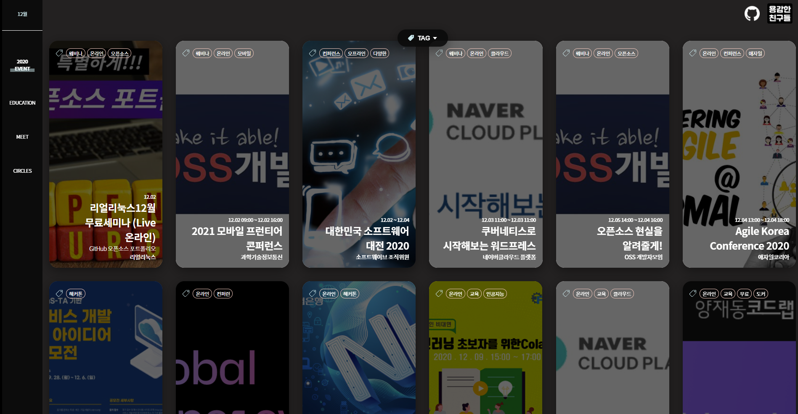

<!-- ALL-CONTRIBUTORS-BADGE:START - Do not remove or modify this section -->

<!-- ALL-CONTRIBUTORS-BADGE:END -->

개발자 컨퍼런스 및 해커톤 일정을 알려드립니다.

 

## 🎈 Dev Event Web(Beta) 공개~

👉 [Dev Event Web 바로가기](https://brave-people.github.io/Dev-Event-Client/)

"용감한 친구들"의 프로젝트 Dev event의 Web 버전이 공개되었습니다!  
프로젝트를 더욱 발전시켜준 [@Woohwahwa](https://github.com/Woohwahwa) 감사합니다!

 

## Contributors ✨

<!-- ALL-CONTRIBUTORS-LIST:START - Do not remove or modify this section -->
<!-- prettier-ignore-start -->
<!-- markdownlint-disable -->
<table>
  <tr>
    <td align="center"><a href="https://landwhale2.github.io/"> <b>HyeokJin Kim</b></a> <a href="#infra-LandWhale2" title="Infrastructure (Hosting, Build-Tools, etc)">🚇</a> <a href="https://github.com/brave-people/Dev-Event/commits?author=LandWhale2" title="Tests">⚠️</a> <a href="https://github.com/brave-people/Dev-Event/commits?author=LandWhale2" title="Code">💻</a></td>
    <td align="center"><a href="http://roeniss.tistory.com"> <b>Roeniss Moon</b></a> <a href="https://github.com/brave-people/Dev-Event/commits?author=roeniss" title="Code">💻</a></td>
    <td align="center"><a href="https://github.com/GwonHeeJun"> <b>GwonHeeJun</b></a> <a href="https://github.com/brave-people/Dev-Event/commits?author=GwonHeeJun" title="Code">💻</a></td>
    <td align="center"><a href="https://imleaf.netlify.com"> <b>TaeGeon Lim</b></a> <a href="https://github.com/brave-people/Dev-Event/commits?author=Im-Tae" title="Code">💻</a></td>
    <td align="center"><a href="https://github.com/Handong-Promi"> <b>Wonbin Lee</b></a> <a href="https://github.com/brave-people/Dev-Event/commits?author=Handong-Promi" title="Code">💻</a></td>
    <td align="center"><a href="https://www.notion.so/Resume-b529fe33c1404bdc9544cf5ea074b742"> <b>S. J. Lee</b></a> <a href="https://github.com/brave-people/Dev-Event/commits?author=occidere" title="Code">💻</a></td>
  </tr>
</table>

<!-- markdownlint-enable -->
<!-- prettier-ignore-end -->
<!-- ALL-CONTRIBUTORS-LIST:END -->

> 저장소에 기여해주신 분들입니다. 모든 분께 감사드립니다 :) PR 환영합니다!

 

## 지난 일정

> 좋은 행사 놓쳐서 후회하면 무엇하리.. 자주 확인하여 참석합시다 :)

- 2020년: [08월](./2020/20_08.md), [09월](./2020/20_09.md), [10월](./2020/20_10.md), [11월](./2020/20_11.md), [12월](./2020/20_12.md)

 

## Dev Event만의 특별함

- [지난 행사 다시보기](./vod/vod.md)
- [지난 행사 후기글](./review/review.md)

 

## 21년 01월

- __코드스테이츠 부트캠프 사전 설명회__
  - 분류: `교육`, `온라인`
  - 주의: 코드스테이츠는 유료 부트캠프입니다.
  - 주최: 코드스테이츠
  - 일시: 01. 04(월) 19:30
  - 신청: [Link](https://www.notion.so/21-1-4-7-30-Expectation-Meeting-dced1b98e34c45018d69207f94191464)
- __데이터 분석/ 클라우드 / 쿠버네티스에 필요한 리눅스 내공 쌓기__
  - 분류: `교육`, `리눅스`
  - 주최: 리얼리눅스
  - 일시: 01. 06 20:00 ~ 21:00 
  - 신청: [Link](https://event-us.kr/hcmY8AAlnJac/event/27555)
- __2021년도 42 SEOUL__
  - 분류: `교육`
  - 주최: 42 SEOUL
  - 일시: 01. 07 시작
  - 신청: [Link](https://innovationacademy.kr/notice?board=4&label=10&post=104)
- __EFK로 쿠버네티스 로그 수집 및 분석하기__ 
  - 분류: `온라인`, `해커톤`, `클라우드`
  - 주최: 네이버 클라우드 플랫폼
  - 일시: 01. 07 11:00 ~ 12:00
  - 신청: [Link](https://innovationacademy.kr/notice?board=4&label=10&post=104)
- __한국인공지능연구소 오픈랩 8기 모집__ 
  - 분류: `인공지능`
  - 주최: 한국인공지능연구소
  - 일시: 01. 08(금) 22:00
  - 신청: [Link](https://www.ai-lab.kr/news/5fed54f001ade691cad53921?fbclid=IwAR3yfaPHMsdY_VmRhYNc-k0f_hwkIUDJbZi02kf79zRPPn39TX2bRR81_v0)
- __MZ 인공지능 해커톤 대회__
  - 분류: `온라인`, `해커톤`, `인공지능`
  - 주최: 한국정보화진흥원
  - 일시: 12. 21 ~ 01. 08
  - 신청: [Link](https://www.mzhackathon.co.kr/mz/)
- __KT DS 자바&파이썬 웹애플리케이션 전문가 양성과정__
  - 분류: `교육`
  - 주최: KT DS
  - 일시: 01. 11 
  - 신청: [Link](http://www.jobkorea.co.kr/Recruit/GI_Read/33437131?OEM_Code=C1)
- __CODING MASTERS__
  - 분류: `채용`
  - 주최: 멀티캠퍼스
  - 일시: 01. 04 ~ 01. 11 
  - 신청: [Link](https://el.multicampus.com/de_common/b2c/event/2020/12/1224_1/1224_1.html)
- __개방형 클라우드 플랫폼 파스-타(PaaS-TA) 전문가 1차 교육__
  - 분류: `교육`, `온라인`, `클라우드`
  - 주최: Paas-TA
  - 일시: 01. 04 ~ 01. 11 
  - 신청: [Link](https://paas-ta.kr/notice/view/207?query=&query_type=all&query_type1=all&start=1)
- __27th SOPT APPJAM Demo Day__
  - 분류: `해커톤`, `온라인`
  - 주최: SOPT
  - 일시: 01. 04 ~ 01. 11 
  - 신청: [Link](https://event-us.kr/onsopt/event/27939)
- __SBA-4차산업 기초SW역량 아카데미__
  - 분류: `교육`, `인공지능`, `무료`
  - 주최: elice
  - 접수: 01. 07 ~ 01. 13
  - 신청: [Link](https://festa.io/events/1369)
- __Hyperledger Meetup Korea #28 - HTS, DeFi 스왑 및 유동성 프로토콜__
  - 분류: `온라인`, `네트워크`
  - 주최: Hyperledger Korea User Group
  - 일시: 01. 13 19:00 ~ 21:00
  - 신청: [Link](https://www.meetup.com/ko-KR/Hyperledger-Korea/events/275518736)
- __GraphQL Korea 1월 온라인 밋업__
  - 분류: `온라인`, `GraphQL`
  - 주최: GraphQL Korea
  - 일시: 01. 16 14:00 ~ 15:00
  - 신청: [Link](https://festa.io/events/1367)
- __Photon 게임서버 엔진 Webinar 토크콘서트__
  - 분류: `웨비나`, `온라인`, `클라우드`
  - 주최: 엔클라우드24
  - 일시: 01. 12 ~ 01. 14
  - [Link](https://onoffmix.com/event/229560)
- __AWS re:Invent__
  - 분류: `세미나`, `온라인`, `무료`
  - 주최: AWS
  - 일시: 01. 12 ~ 01. 14
  - [Link](https://reinvent.awsevents.com/)
- __클라우드 보안 A-Z까지: 다양한 리소스 보호 상품 살펴보기__
  - 분류: `세미나`, `온라인`, `클라우드`
  - 주최: 네이버 클라우드 플랫폼
  - 일시: 01. 14
  - [Link](https://register.gotowebinar.com/register/6677054151586882832)
- __.NET Conf 2021 x Seoul__
  - 분류: `온라인`, `컨퍼런스`, `.NET`
  - 주최: 닷넷데브
  - 일시: 01. 15(금) 10:00
  - 신청: [Link](https://www.notion.so/NET-Conf-2021-x-Seoul-228462238add4fc5a885fb81e2687528)
- __Microsoft Azure Virtual Training Day: 서버 인프라 마이그레이션__
  - 분류: `온라인`, `클라우드`,
  - 주최: Microsoft Azure
  - 일시: 01. 20 14:00 - 17:00
  - 신청: [Link](https://mktoevents.com/Microsoft+Event/228198/157-GQE-382)
- __애자일 코리아 1월 밋업 "가트너 2021 전략적 기술 트랜드 세미나"__
  - 분류: `온라인`, `유료`, `에자일`,
  - 주최: 애자일 코리아
  - 일시: 01. 20 21:00 - 23:00
  - 신청: [Link](https://festa.io/events/1372)
- __S/W 기업이 SaaS 비즈니스 모델을 고민해야 하는 이유__
  - 분류: `온라인`, `컨퍼런스`, `클라우드`
  - 주최: 네이버 클라우드 플랫폼
  - 일시: 01. 21(목) 11:00 ~ 12:00
  - 신청: [Link](https://register.gotowebinar.com/register/3846901326086790928)   
- __AWS Builders Online Series__
  - 분류: `온라인`, `컨퍼런스`, `클라우드`
  - 주최: AWS
  - 일시: 01. 21(목)
  - 신청: [Link](https://aws.amazon.com/ko/events/builders-online-series/)
- __2020 DACON CUP__
  - 분류: `해커톤`, `데이터`
  - 주최: DACON 
  - 일시: 12. 18 ~ 01. 22 
  - 신청: [Link](https://dacon.io/competitions/official/235683/overview/l)
- __MZ 인공지능 해커톤 대회__
  - 분류: `온라인`, `해커톤`, `인공지능`
  - 주최: NIA(한국지능정보사회진흥원)
  - 신청: 01. 11(월) ~ 01. 24(일)
  - 신청: [Link](https://mzhackathonmedical.co.kr/mzmedical/)
- __태양광 발전량 예측 AI 경진대회__
  - 분류: `해커톤`, `데이터`
  - 주최: DACON 
  - 일시: 12. 09 ~ 01. 26
  - 신청: [Link](https://dacon.io/competitions/official/235680/overview/)

- __DATA 누구에게나 처음은 있었다.__
  - 분류: `웨비나`, `Data`
  - 주최: 원티드
  - 일시: 01. 28(금) 19:30 ~ 21:05
  - 신청: [Link](https://www.wanted.co.kr/events/careertalk08)
- __성공사례를 통한 오라클 클라우드 기반 DB 마이그레이션과 DR 서비스 활용방안__
  - 분류: `온라인`, `컨퍼런스`, `클라우드`
  - 주최: 오라클, 메가존클라우드
  - 일시: 01. 29(금) 15:00 ~ 16:00
  - 신청: [Link](https://www.allshowtv.com/detail.html?idx=486)
- __성장하는 iOS개발자 되기__
  - 분류: `웨비나`, `ios`
  - 주최: 원티드
  - 일시: 01. 29(금) 19:30 ~ 21:05
  - 신청: [Link](https://www.wanted.co.kr/events/livetalk16)

 

## 21년 02월

 

## 21년 03월

- __AI EXPO KOREA 2021__
  - 분류: `온라인`, `컨퍼런스`, `.NET`
  - 주최: 서울에쎄
  - 일시: 03. 24(수) 10:00 ~ 03. 26(금) 17:00
  - 신청: [Link](https://event-us.kr/zvKlsXnNkKW6/event/26657)

---------------

 

## 개발 교육

- __양재동 코드랩__
  - 홈페이지: [www.codelabs.kr](https://www.codelabs.kr/)
  - 유튜브: [Link](https://www.youtube.com/channel/UC7SGsu80wfuTyQWo-PKatvg?view_as=subscriber)
- __스프링 캠프__
  - 최근 모임: 2019 스프링 캠프(19. 04. 27.)
  - 홈페이지: [springcamp.io/2019](https://www.springcamp.io/2019/)
- __CCCR 아카데미__
  - 홈페이지: [cccr-edu](https://www.cccr-edu.or.kr/main/index.jsp)
- __모두의 연구소__
  - 홈페이지: [pay.modulabs.co.kr](http://pay.modulabs.co.kr/)

 

## 개발자 모임

- __스프린트 서울__
  - 홈페이지: [www.sprintseoul.org](https://www.sprintseoul.org/)
  - 수다방: [gitter.im/sprintseoul/community](https://gitter.im/sprintseoul/community)
- __우아한 테크의 밤__
  - 최근 모임: 19. 12. 18
- __DevOps Korea__
  - 홈페이지: [Facebook DevOps](https://www.facebook.com/groups/TeAnE/)
- __IT인프라 엔지니어 그룹 밋업__
  - 최근 모임: 19. 12. 19.
  - 홈페이지: [Facebook. IT 인프라 엔지니어 그룹](https://www.facebook.com/groups/InfraEngineer/)
- __GDG DevFest Seoul__
  - 최근 모임: 19. 10. 20.
  - 홈페이지: [Facebook. GDG DevFest Korea](https://www.facebook.com/devfest.seoul.2019/)
- __OSS 개발자 포럼 2020__
  - 홈페이지: [Facebook. OSS Dev Forum](https://www.facebook.com/groups/ossdevforum)
- __Google Developers Experts__
  - 홈페이지: [developers.google.com](https://developers.google.com/community/experts)
- __오픈 인프라 2020__
	- 링크: [Link](http://oidc.co.kr/)

 

## 개발자 동아리

- __DDD IT 연합 동아리__
  - 최근 모임: 20. 02. 15.
- __한이음__
  - 설명: 대학생 멘티와 지도교수, 기업전문가 ICT멘토가 팀을 이루어 현업 실무 기술이반영된 프로젝트를 수행
  - 홈페이지: [www.hanium.or.kr](https://www.hanium.or.kr/portal/hanium/businessOverview.do)
- __넥스터즈__
  - 개발자와 디자이너 연합 동아리
  - 홈페이지: [Link](http://teamnexters.com/)
- __yapp__
  - 대학생 연합 동아리로서 현재 17기 활동중
  - 홈페이지: [Link](http://yapp.co.kr/)
- __매쉬업__
  - 10기 모집: 2020. 11. 10 ~ 11. 15
  - 홈페이지: [Link](https://mash-up.it/)
  - Facebook 링크: [Link](https://www.facebook.com/mashupgroup/)
- __AUSG__
  - AWS 대학생 그룹. 클라우드와 프로그래밍에 관심이 있는 다양한 대학생이 모여 프로젝트를 진행.
  - 2020년 9월에 선발된 4기 멤버들이 주축으로 활동 진행 중
  - 링크: [Link](https://www.notion.so/ausg/AUSG-AWS-f587ae7e146f4c37a313170e1ba603e7/)

 

더 많은 모임을 만나고 싶다면? [meetup.com](https://www.meetup.com/ko-KR/find/tech/)

 

|
 
|
|:--:|
| *용감한 친구들 with 남송리 3번지* |
